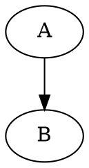
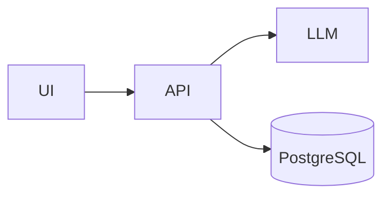
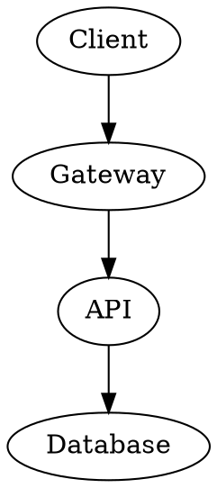

# MarkView Fork — Codex Implementation Plan

## 0. Purpose

This document is the implementation brief for a fork of **MarkView**.

Upstream:
- MarkView: https://github.com/scos-lab/markview
- DocView reference: https://github.com/simota/docview

The goal is **not** to turn MarkView into an editor, note-taking app, IDE, wiki, or knowledge-management product.

The goal is:

> **Double-click a Markdown file and render almost anything a modern AI/LLM is likely to put into it — quickly, beautifully, safely, and read-only.**

The target use case is technical/architecture/specification Markdown produced by ChatGPT, Claude, Codex, Gemini, local LLMs, documentation generators, and engineering tools.

---

## 1. Non-negotiable product principles

These are hard requirements.

### 1.1 Read-only
- No Markdown editor.
- No split editor/preview mode.
- No WYSIWYG editing.
- No note graph.
- No vault/workspace concept.
- No account.
- No cloud sync.
- No collaboration system.

The user edits files elsewhere. MarkView only renders them.

### 1.2 Fast startup
Opening a normal Markdown file should remain extremely fast.

Do not eagerly load large diagram/chart libraries.

Heavy renderers must be lazy-loaded.

### 1.3 Local-first
Rendering should happen locally whenever technically possible.

Avoid external rendering services.

Features that inherently require a remote service must be disabled by default or excluded.

### 1.4 AI-native Markdown
Favor structures commonly emitted by LLMs and developer tooling:
- Mermaid
- math
- tables
- alerts/admonitions
- emoji
- diagrams
- JSON/YAML examples
- architecture blocks
- Graphviz/DOT
- D2
- Markmap
- code blocks
- front matter
- rich callouts

### 1.5 Graceful degradation
A renderer failure must never make the whole document unreadable.

For any unsupported or invalid specialized block:
1. show a small render error,
2. preserve the original source,
3. allow source to remain readable/copyable.

---

## 2. Verified upstream baseline

At the time this plan was written, MarkView advertises:

- Tauri 2
- Rust desktop shell
- React 19
- TypeScript
- Vite 6
- TailwindCSS 4
- Zustand
- Unified / Remark / Rehype Markdown pipeline
- Mermaid
- Vega-Lite
- KaTeX
- GFM
- syntax highlighting
- table of contents
- folder browser
- in-document search
- dark/light themes
- file watching
- drag/drop
- recent files
- print
- multiple tabs
- default `.md` file association

Current upstream release seen during planning: `v1.0.5`.

Before changing code, **inspect the repository** and treat the checked-out source as authoritative. Do not assume paths or component names from this planning document.

---

## 3. Reference behavior from DocView

DocView is useful as a feature-reference implementation, but it uses a different Markdown stack.

Relevant DocView features include:

- CommonMark / GFM
- footnotes
- definition lists
- subscript / superscript
- emoji
- front matter
- GitHub Alerts
- Mermaid
- KaTeX
- Marp slides
- YAML / JSON tree views
- CSV / JSONL sortable tables
- sandboxed HTML view
- config-file syntax views
- image display
- file tree
- auto reload
- tabs
- TOC
- search

Do **not** replace MarkView's Unified/Remark/Rehype pipeline with DocView's parser just to copy features.

Prefer equivalent Remark/Rehype plugins or dedicated renderer components.

Both projects use MIT licensing. Preserve required copyright/license notices for any copied/adapted code.

---

# 4. First Codex task: repository audit

Before implementing features, inspect the actual MarkView codebase.

Produce a concise `docs/RENDERER_AUDIT.md` containing:

1. Markdown entry component(s).
2. Unified/Remark/Rehype plugin configuration.
3. Existing fenced-code handling.
4. Mermaid renderer location.
5. Vega-Lite renderer location.
6. KaTeX implementation.
7. syntax highlighting implementation.
8. HTML sanitization policy.
9. theme propagation to renderers.
10. current bundle splitting/lazy loading.
11. current test framework and test coverage.
12. Tauri commands relevant to file handling.
13. areas where specialized renderers are hard-coded.
14. a proposed minimal refactor plan.

Do not perform a large rewrite merely for architectural purity.

---

# 5. Target architecture

The key architectural change is a **specialized renderer registry**.

The Markdown pipeline should remain responsible for Markdown parsing.

Specialized fenced blocks should be routed through a registry rather than accumulating conditionals in one giant component.

Conceptually:

```text
Markdown source
    |
    v
Unified / Remark
    |
    v
MDAST / HAST
    |
    +---------------------+
    | normal Markdown     |
    | headings            |
    | tables              |
    | links               |
    | alerts              |
    | math                |
    +---------------------+
    |
    v
fenced code block
    |
    v
Renderer Registry
    |
    +-- mermaid     -> MermaidRenderer
    +-- vega        -> VegaRenderer
    +-- vega-lite   -> VegaRenderer
    +-- d2          -> D2Renderer
    +-- dot         -> GraphvizRenderer
    +-- graphviz    -> GraphvizRenderer
    +-- markmap     -> MarkmapRenderer
    +-- wavedrom    -> WaveDromRenderer
    +-- plantuml    -> PlantUMLRenderer (optional/local-only)
    +-- unknown     -> SyntaxHighlightedCodeRenderer
```

Suggested conceptual interface:

```ts
export interface SpecializedRenderer {
  id: string;
  languages: string[];
  canRender?: (source: string, language: string) => boolean;
  render: React.LazyExoticComponent<React.ComponentType<RendererProps>>;
}
```

Exact implementation is Codex's decision after inspecting the source.

Requirements:
- renderer lookup is centralized;
- renderer modules can lazy-load;
- aliases are easy to add;
- failures fall back cleanly;
- individual renderers can be disabled if needed;
- adding a new renderer should not require editing the core Markdown component in several places.

---

# 6. Feature priorities

## P0 — Extend Markdown compatibility

Implement these first because they are lightweight and common in AI-generated Markdown.

### 6.1 GitHub Alerts / callouts

Support:

```md
> [!NOTE]
> Useful information.

> [!TIP]
> Helpful suggestion.

> [!IMPORTANT]
> Important information.

> [!WARNING]
> Something can go wrong.

> [!CAUTION]
> Potentially dangerous action.
```

Requirements:
- visually distinct;
- good dark/light theme;
- accessible semantic markup;
- icon + text label;
- printable;
- nested Markdown inside callout works.

Do not hard-code SVG repeatedly. Reuse the existing icon system if practical.

### 6.2 Emoji shortcodes

Support common shortcode syntax:

```md
:rocket:
:warning:
:white_check_mark:
:brain:
```

Unicode emoji must continue to work normally:

```text
🚀 ⚠️ ✅ 🧠
```

Avoid turning arbitrary colon-delimited strings into emoji unexpectedly.

### 6.3 Front matter

Recognize YAML front matter:

```yaml
---
title: System Architecture
author: Example
tags:
  - architecture
  - AI
---
```

Default behavior:
- do not dump raw front matter at the top of the rendered document;
- parse it;
- expose it to features such as Marp detection;
- optionally provide a compact collapsible metadata block.

Malformed front matter should not break rendering.

### 6.4 Definition lists

Support:

```md
API
: Application Programming Interface

RAG
: Retrieval-Augmented Generation
```

### 6.5 Superscript and subscript

Support conventional Markdown extension syntax when a stable plugin exists.

Examples:

```md
H~2~O
x^2^
```

Do not interfere with KaTeX parsing.

---

# 7. P0 — Icon support

"Icons" can mean several distinct formats. Handle them deliberately.

## 7.1 Existing Unicode

Must work:

```md
✅ Complete
⚠️ Warning
🧠 AI
🚀 Deploy
```

## 7.2 Emoji aliases

Covered above:

```md
:warning:
:rocket:
```

## 7.3 MarkView/Lucide icon extension

MarkView already uses Lucide internally according to its dependency stack/history. If confirmed in the checked-out source, support a safe custom Markdown extension such as:

```md
:lucide-database:
:lucide-server:
:lucide-brain:
:lucide-shield:
```

Desired rendering:

```text
[database icon] PostgreSQL
[server icon] API
[brain icon] LLM
[shield icon] Security
```

Requirements:
- lazy or tree-shaken icon loading where practical;
- invalid icon name falls back to literal text;
- icons inherit text color;
- baseline alignment is visually correct;
- accessible label/aria behavior;
- no arbitrary HTML injection.

If the syntax would conflict badly with emoji parsing, choose a better explicit syntax and document it.

---

# 8. P1 — Additional diagram renderers

## 8.1 D2

Support:

````md
```d2
client -> api
api -> postgres
```
````

Preference:
- browser/WASM renderer if mature;
- local bundled renderer;
- no mandatory external server.

Requirements:
- lazy load;
- theme-aware where possible;
- source fallback on errors.

## 8.2 Graphviz / DOT

Support aliases:

````md

````

and:

````md

````

Preference:
- WASM/browser renderer such as Viz.js-style implementation;
- no system Graphviz installation required for normal usage.

## 8.3 Markmap

Support:

````md
```markmap
# Architecture
## API
### Laravel
## Data
### PostgreSQL
## AI
### LLM
```
````

Requirements:
- pan/zoom if lightweight;
- printable static output;
- readable fallback.

## 8.4 WaveDrom

Useful for protocol/timing documentation.

Support only if dependency impact is reasonable.

````md
```wavedrom
{ signal: [
  { name: "clk", wave: "p....." },
  { name: "data", wave: "x.345x", data: "A B C" }
]}
```
````

## 8.5 PlantUML

Lower priority.

Only implement if rendering can be kept local and dependency size/runtime is acceptable.

Do not silently send document source to a public PlantUML server.

---

# 9. P1 — Marp slide support

Detect:

```yaml
---
marp: true
---
```

Provide a "Slides" viewing mode.

Requirements:
- normal Markdown reader remains default;
- slides mode is opt-in;
- support common Marp directives;
- preserve read-only philosophy;
- do not build a slide editor.

If full Marp rendering adds excessive complexity or bundle weight, isolate it behind lazy loading.

---

# 10. P2 — Structured non-Markdown file viewing

This is valuable, but it must not distract from Markdown support.

Possible supported formats:

## 10.1 JSON
- collapsible tree;
- raw/source toggle;
- syntax highlighting;
- copy value/path;
- search.

## 10.2 YAML
- collapsible structure;
- raw/source toggle;
- gracefully handle multi-document YAML.

## 10.3 JSONL
- table when rows are consistently shaped;
- raw view fallback;
- large-file safeguards.

## 10.4 CSV
- sortable table;
- frozen header;
- sensible column width;
- row count;
- raw/source toggle;
- large-file virtualization if necessary.

## 10.5 Config
Read-only syntax-highlighted display for:
- TOML
- INI
- `.env`
- `.conf`
- `.properties`

This phase should reuse the viewer shell, tabs, file browser and search infrastructure rather than creating a second application architecture.

---

# 11. P2 — HTML preview

Optional.

If implemented:
- sandboxed iframe;
- scripts OFF by default;
- no automatic remote privilege;
- clear Preview / Source toggle;
- external links handled safely.

Security is more important than feature completeness.

---

# 12. Markdown raw HTML policy

Review current behavior before changing it.

We want useful Markdown rendering without making local documents a trivial script-execution vector.

Preferred policy:
- standard Markdown is sanitized;
- raw HTML support, if enabled, uses an allowlist;
- scripts are never executed from Markdown;
- event handlers are stripped;
- dangerous URLs are sanitized;
- iframe/object/embed should be blocked by default;
- local file access must not become broader than required.

Do not disable sanitization merely to support Font Awesome HTML snippets.

Prefer native Markdown extensions or Lucide syntax.

---

# 13. Performance requirements

Performance is part of the product.

## 13.1 Lazy loading

Heavy features should load only when needed:
- Mermaid
- Vega/Vega-Lite
- D2
- Graphviz
- Markmap
- WaveDrom
- Marp

A README containing only headings, text, tables and code must not pull all diagram engines into the initial bundle.

## 13.2 Large documents

Test at least:
- 100 KB Markdown
- 1 MB Markdown
- 5 MB Markdown

The UI should remain usable.

Potential strategies:
- memoized AST/rendering;
- defer heavy blocks;
- avoid repeated whole-document parsing for simple UI state changes;
- render expensive blocks independently;
- debounce file-watcher events.

Do not prematurely virtualize ordinary Markdown if it breaks anchor navigation, TOC or browser find behavior.

## 13.3 Renderer isolation

A malformed Mermaid/D2/DOT block must not trigger a render loop.

Each specialized renderer should have:
- error boundary;
- source fallback;
- loading state;
- stable memoization key.

---

# 14. UX requirements

## 14.1 Default flow

Desired Windows experience:

```text
double-click README.md
        ->
MarkView opens
        ->
fully rendered document
```

No project creation dialog.

No import process.

No "create vault".

## 14.2 Fenced block controls

For rendered diagrams/charts, add a subtle hover toolbar where appropriate:
- copy source;
- show source / show rendered;
- zoom/reset for diagrams;
- export SVG/PNG only if cheap and local.

Do not clutter every block by default.

## 14.3 Link behavior

Handle:
- external HTTP/HTTPS links;
- relative Markdown links;
- relative image links;
- anchors;
- links to local files.

Relative links should resolve from the current file's directory.

Opening another `.md` file should stay inside MarkView where practical.

## 14.4 Images

Support local relative images robustly.

Consider:
- zoom;
- click to fit/full-size;
- SVG;
- WebP;
- GIF.

Do not break print output.

---

# 15. Theme requirements

All custom renderers must work in:
- light theme;
- dark theme;
- system theme.

Avoid hard-coded dark-blue/navy combinations.

Renderers should use shared theme tokens rather than each inventing their own palette.

Mermaid, Vega, D2, Graphviz and Markmap should react appropriately when the theme changes.

If a renderer cannot update dynamically, rerender that block rather than reloading the document.

---

# 16. Accessibility

Minimum:
- keyboard-accessible controls;
- visible focus states;
- semantic headings;
- callout labels readable by screen readers;
- diagram source available for users who cannot interpret the graphic;
- appropriate ARIA labels;
- sufficient theme contrast.

---

# 17. Testing strategy

Add tests as features are implemented.

## 17.1 Markdown fixture corpus

Create:

```text
tests/fixtures/markdown/
```

Include files for:

- `gfm.md`
- `alerts.md`
- `emoji.md`
- `frontmatter.md`
- `definitions.md`
- `sub-sup.md`
- `math.md`
- `mermaid.md`
- `vega.md`
- `d2.md`
- `graphviz.md`
- `markmap.md`
- `wavedrom.md`
- `mixed-ai-output.md`
- `malformed-renderers.md`
- `relative-images.md`
- `relative-links.md`
- `large-document.md`

`mixed-ai-output.md` is especially important. It should look like a realistic architecture document generated by an LLM and exercise many renderers in one file.

## 17.2 Unit tests
Test:
- parser plugins;
- renderer registry selection;
- aliases;
- sanitization;
- failure fallback;
- front matter parsing;
- emoji/icon parsing.

## 17.3 Component tests
Test specialized renderers where practical.

## 17.4 End-to-end tests
At minimum:
1. open `.md`;
2. render standard Markdown;
3. render alert;
4. render Mermaid;
5. render additional diagram type;
6. follow relative Markdown link;
7. theme toggle;
8. external file change auto-reload;
9. malformed renderer fallback;
10. print doesn't include viewer chrome.

Use the repository's existing testing stack where possible. Do not introduce multiple redundant test frameworks.

---

# 18. Security tests

Explicitly test Markdown containing:

```html
<script>alert('xss')</script>

<a href="javascript:alert('xss')">click</a>
<iframe src="file:///..."></iframe>
```

Expected:
- no script execution;
- dangerous attributes/protocols removed or blocked;
- normal safe Markdown still renders.

Also verify specialized renderer libraries are not configured to execute arbitrary JS from document content.

---

# 19. Licensing

MarkView is MIT licensed.

DocView is also MIT licensed.

Rules:
- preserve MarkView's upstream LICENSE;
- if code is directly copied/adapted from DocView, preserve appropriate MIT attribution;
- prefer reimplementation using equivalent libraries when simple;
- document third-party renderer licenses in a dependency/license report;
- avoid introducing GPL dependencies unless deliberately approved.

Create or update:

```text
THIRD_PARTY_NOTICES.md
```

if new dependencies require notices.

---

# 20. Suggested implementation sequence

Do this incrementally.

## Phase A — Audit and safety net
1. run existing app;
2. run tests;
3. inspect parser/renderers;
4. create `RENDERER_AUDIT.md`;
5. add mixed Markdown fixture;
6. add baseline regression tests.

## Phase B — Markdown compatibility
1. GitHub Alerts;
2. emoji shortcodes;
3. front matter;
4. definition lists;
5. superscript/subscript;
6. tests.

## Phase C — Renderer registry
1. introduce registry abstraction;
2. migrate existing Mermaid;
3. migrate existing Vega-Lite;
4. ensure syntax-highlight fallback;
5. add common renderer error boundary;
6. confirm lazy loading.

No behavior regressions during the migration.

## Phase D — Technical diagrams
1. Graphviz/DOT;
2. D2;
3. Markmap;
4. WaveDrom if lightweight;
5. tests + fixture docs.

## Phase E — Icons
1. confirm Lucide architecture/dependencies;
2. implement safe icon Markdown syntax;
3. theme/accessibility;
4. test unknown icons.

## Phase F — Marp
1. front matter detection;
2. lazy-loaded presentation mode;
3. print behavior;
4. theme compatibility.

## Phase G — Structured viewers
1. JSON;
2. YAML;
3. CSV;
4. JSONL;
5. config files.

Only start this phase once Markdown rendering is solid.

---

# 21. Do not do these things

Codex must not:

- replace Tauri with Electron;
- turn the app into an editor;
- add a database;
- add authentication;
- add cloud sync;
- require an account;
- add telemetry;
- require a hosted backend;
- send Markdown/diagram source to external services by default;
- make Mermaid/Graphviz/etc. eager dependencies in the startup bundle;
- remove GFM behavior;
- remove current file association features;
- break Windows support;
- perform a giant unrelated redesign;
- rewrite working Rust backend code without a concrete reason;
- replace Unified/Remark/Rehype with another parser just because a reference project uses it.

---

# 22. Acceptance criteria

The fork is successful when the following file renders cleanly in a single viewer session:

```md
---
title: AI Platform Architecture
tags: [architecture, ai]
---

# AI Platform Architecture

> [!IMPORTANT]
> Production traffic must use the gateway.

:lucide-brain: **LLM Layer**  
:rocket: Deployment ready.

## Architecture



## Service relationships



## Alternative architecture

```d2
Client -> Gateway
Gateway -> API
API -> PostgreSQL
API -> LLM
```

## Topic map

```markmap
# Platform
## API
### Laravel
## Data
### PostgreSQL
## AI
### LLM
```

## Formula

$$
P(x) = \frac{e^x}{\sum_i e^{x_i}}
$$

## Status

| Service | Status |
|---|---|
| API | ✅ |
| Database | ✅ |
| LLM | ⚠️ |

API
: Application Programming Interface

The molecule H~2~O contains hydrogen.

The expression x^2^ is squared.
```

Expected:
- no raw specialized code shown unless toggled;
- diagrams render locally;
- alerts look intentional;
- icons/emoji render;
- math renders;
- GFM table renders;
- definition/sub/sup syntax renders;
- dark/light mode works;
- print is readable;
- invalid blocks degrade to source rather than breaking the page.

---

# 23. Codex execution instructions

When starting work:

1. Read this entire file.
2. Inspect the repository before making architectural assumptions.
3. Build/run the current application.
4. Run existing tests.
5. Produce `docs/RENDERER_AUDIT.md`.
6. Make small commits by logical feature.
7. Preserve existing behavior unless this plan explicitly changes it.
8. Add tests with every renderer/plugin.
9. Prefer maintained dependencies.
10. Check dependency licenses.
11. Measure bundle impact when adding heavy libraries.
12. Keep the normal Markdown path fast.
13. Keep the app read-only.

When a plan item conflicts with the checked-out source architecture, prefer the smallest design that achieves the intent and document the deviation.

---

# 24. Suggested Codex starter prompt

Use this after cloning/forking MarkView and placing this file in the repo root:

```text
Read MARKVIEW_FORK_PLAN.md completely.

Then inspect the current repository. Do not assume the file/component names in the plan are exact.

First:
1. install dependencies,
2. run/build the application,
3. run the existing tests,
4. inspect the Markdown rendering pipeline,
5. write docs/RENDERER_AUDIT.md with the current architecture and the minimal refactor required.

After the audit, implement Phase A and Phase B from MARKVIEW_FORK_PLAN.md.

Important constraints:
- preserve the read-only viewer philosophy;
- do not turn MarkView into an editor or note-taking app;
- preserve fast startup;
- keep heavy rendering libraries lazy-loaded;
- do not send document content to remote render services;
- maintain safe HTML/sanitization behavior;
- add tests for every new Markdown extension.

Make changes directly in the repository and validate the build/tests after each logical group of changes.
```

---

# 25. Later Codex prompt — renderer phase

After Phase A/B is stable:

```text
Continue from MARKVIEW_FORK_PLAN.md.

Implement Phase C: introduce the specialized renderer registry and migrate the existing Mermaid and Vega-Lite handling into it without regressions.

Then implement Phase D in this order:
1. Graphviz/DOT
2. D2
3. Markmap

Requirements:
- lazy loading;
- local rendering only;
- renderer-level error boundaries;
- source fallback on malformed input;
- dark/light theme support;
- fixture documents and automated tests;
- measure/report bundle impact.

Do not start structured JSON/YAML/CSV viewers yet.
```

---

# 26. Product statement

Keep this sentence in mind when making trade-offs:

> **MarkView should be the fastest way to turn an AI-generated `.md` file into the document the AI intended the human to see.**
