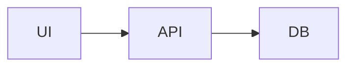
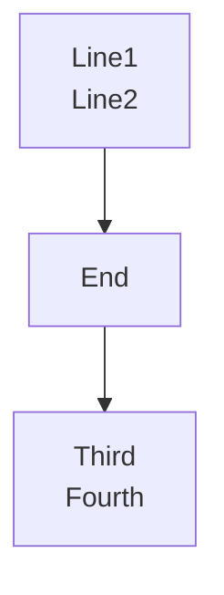

```mermaid
flowchart LR
  UI --> API
  API --> DB
```

Node labels containing a line break serialize as HTML inside `<foreignObject>`,
which an XML parse rejects. This is the most common shape in LLM-written Mermaid.

```mermaid
flowchart TD
  A[Line1<br/>Line2] --> B[End]
  B --> C[Third<br>Fourth]
```
