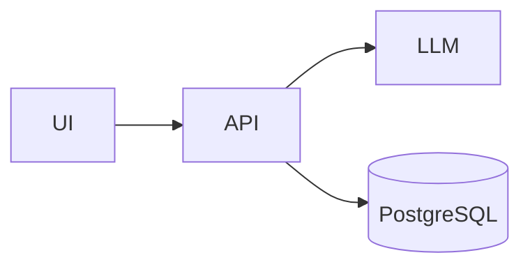
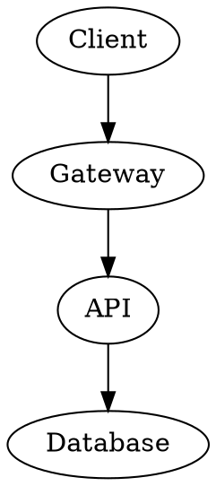

# AI Platform Architecture

> [!IMPORTANT]
> Production traffic must use the **gateway**.

:lucide-brain: **LLM Layer**  
:rocket: Deployment ready.

## Architecture



## Service relationships



## Alternative architecture

```d2
Client -> Gateway
Gateway -> API
API -> PostgreSQL
API -> LLM
```

## Topic map

```markmap
# Platform
## API
### TypeScript
## Data
### PostgreSQL
## AI
### LLM
```

## Formula

$$
P(x) = \frac{e^x}{\sum_i e^{x_i}}
$$

| Service | Status |
|---|---|
| API | ✅ |
| Database | ✅ |
| LLM | ⚠️ |

API
: Application Programming Interface

The molecule H~2~O contains hydrogen. The expression x^2^ is squared.
